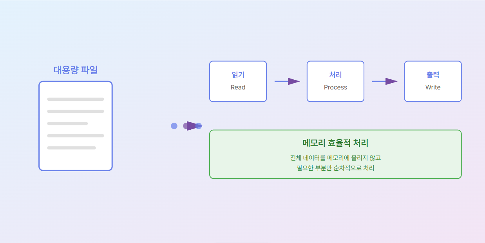

# Step 1: 스트리밍 기초 개념 이해

## 🎯 학습 목표
- 왜 스트리밍 처리가 필요한지 이해하기
- 메모리 효율적인 데이터 처리 방식 이해하기
- 대용량 파일 처리의 기본 개념 습득하기

## 📚 핵심 개념

### 문제 상황
10GB 크기의 로그 파일을 분석해야 한다면?

#### ❌ 잘못된 방법: 전체 로드
```
파일 전체 → 메모리 (10GB) → 처리
```
**문제점**:
- 메모리 부족 (Out of Memory)
- 컴퓨터가 비명을 지름 😱
- 프로그램 크래시

#### ✅ 올바른 방법: 스트리밍
```
파일 일부 → 메모리 (1MB) → 처리 → 버림
파일 일부 → 메모리 (1MB) → 처리 → 버림
파일 일부 → 메모리 (1MB) → 처리 → 버림
...
```
**장점**:
- 일정한 메모리 사용량
- 파일 크기에 무관
- 안정적인 실행

## 🌊 스트리밍이란?

> 물이 흐르듯이 데이터를 조금씩 읽고, 처리하고, 버리는 방식

### 비유
- **전체 로드**: 바다 전체를 컵에 담으려는 것
- **스트리밍**: 수도꼭지에서 물을 받아 마시는 것

## 📊 처리 플로우

```
┌─────────────┐
│ 대용량 파일 │
│   (10GB)    │
└──────┬──────┘
       │
       ├─→ 읽기 (Read)  ──→ 1MB 청크
       │                    ↓
       │                  처리 (Process)
       │                    ↓
       ├─→ 출력 (Write) ←─── 결과
       │
       └─→ 반복...
```

### 시각화 다이어그램



**참고**: 위 다이어그램은 대용량 파일을 스트리밍 방식으로 처리하는 전체 흐름을 보여줍니다.

## 💡 핵심 원리

### 1. 필요한 만큼만 읽기
- 전체 데이터를 메모리에 올리지 않음
- 작은 버퍼(예: 1MB)만 사용

### 2. 순차적 처리
- 읽기 → 처리 → 출력 → 버리기
- 다음 데이터로 이동

### 3. 메모리 재사용
- 같은 버퍼를 계속 재사용
- 메모리 사용량 일정 유지

## 📈 성능 비교

| 처리 방식 | 10GB 파일 메모리 사용량 | 결과 |
|---------|---------------------|------|
| 전체 로드 | 10GB | ❌ 크래시 |
| 스트리밍 (1MB 버퍼) | 1MB | ✅ 성공 |

## 🎓 실습 과제

### 과제 1: 개념 이해하기
다음 상황에서 어떤 방법을 사용해야 할까요?

1. 5GB 동영상 파일을 다른 형식으로 변환
2. 100KB JSON 파일 파싱
3. 1TB 데이터베이스 덤프 파일 분석
4. 사용자가 업로드한 1MB 이미지 처리

**정답**:
- 1번: 스트리밍 (대용량)
- 2번: 전체 로드 가능 (소용량)
- 3번: 스트리밍 (대용량)
- 4번: 전체 로드 가능 (소용량)

### 과제 2: 메모리 계산하기
다음 시나리오의 메모리 사용량을 계산하세요:

**시나리오**: 100GB 파일을 4KB 버퍼로 스트리밍 처리
- 사용 메모리: ?

**정답**: 약 4KB (버퍼 크기)

## 🔑 핵심 요약

1. **스트리밍**: 데이터를 조금씩 처리하는 방식
2. **메모리 효율**: 파일 크기와 무관하게 일정한 메모리 사용
3. **대용량 처리**: 100GB 파일도 1MB 메모리로 처리 가능
4. **핵심**: 읽기 → 처리 → 버리기 반복

## ➡️ 다음 단계

**Step 2: io 패키지 핵심 인터페이스**
- Go에서 스트리밍을 어떻게 구현하는지 배웁니다
- `io.Reader`와 `io.Writer` 인터페이스 학습

