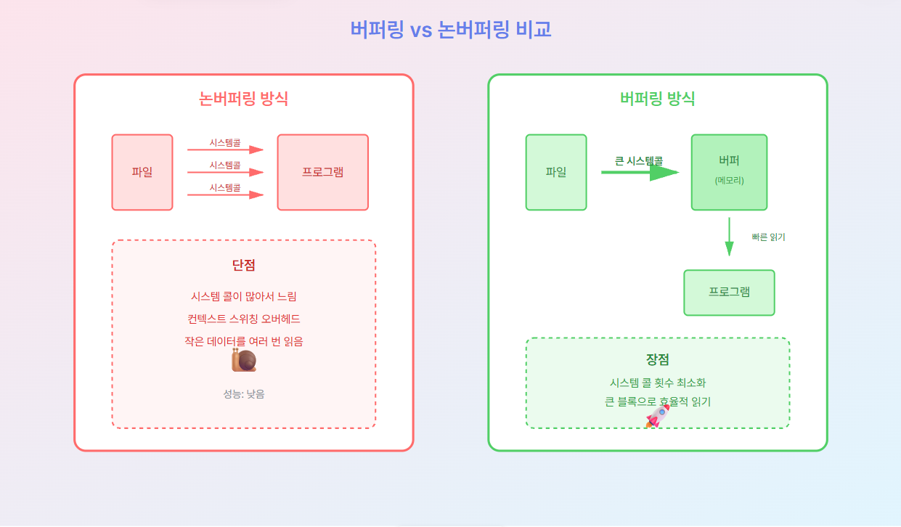

# Step 4: 파일 처리 실전 테크닉

## 🎯 학습 목표
- 안전한 파일 열기/닫기 방법
- `bufio` 패키지로 효율적인 I/O
- 청크 단위 대용량 파일 처리
- 버퍼링 vs 논버퍼링 성능 차이 이해

## 📂 파일 열기와 닫기

### os.Open - 읽기 전용
```go
func Open(name string) (*File, error)
```
- 읽기 전용으로 파일 열기
- 파일이 없으면 에러
- 가장 많이 사용되는 함수

### os.Create - 생성/덮어쓰기
```go
func Create(name string) (*File, error)
```
- 파일 생성 (이미 있으면 덮어쓰기)
- 쓰기 전용으로 열림
- 권한: 0666 (읽기/쓰기)

### os.OpenFile - 세밀한 제어
```go
func OpenFile(name string, flag int, perm FileMode) (*File, error)
```
- 플래그로 모드 지정
- 권한 지정 가능
- 가장 유연한 방법

## 🎛️ OpenFile 플래그

### 접근 모드 (택1 필수)
| 플래그 | 의미 |
|-------|------|
| `os.O_RDONLY` | 읽기 전용 |
| `os.O_WRONLY` | 쓰기 전용 |
| `os.O_RDWR` | 읽기/쓰기 |

### 추가 옵션 (조합 가능)
| 플래그 | 의미 |
|-------|------|
| `os.O_APPEND` | 파일 끝에 추가 |
| `os.O_CREATE` | 파일 없으면 생성 |
| `os.O_TRUNC` | 파일 열 때 내용 비우기 |
| `os.O_EXCL` | CREATE와 함께 사용, 이미 있으면 에러 |

### 플래그 조합 예시
```go
// 추가 모드로 열기 (없으면 생성)
os.O_APPEND | os.O_CREATE | os.O_WRONLY

// 새 파일 만들기 (있으면 에러)
os.O_CREATE | os.O_EXCL | os.O_WRONLY

// 내용 지우고 쓰기
os.O_TRUNC | os.O_WRONLY
```

## ✅ defer로 리소스 정리

### 필수 패턴
```go
file, err := os.Open("example.txt")
if err != nil {
    return err
}
defer file.Close()  // ← 이 한 줄이 중요!

// 파일 작업...
```

### defer가 중요한 이유
1. **자동 정리**: 함수 종료 시 무조건 실행
2. **에러 상황 대응**: panic이나 return 해도 실행됨
3. **리소스 누수 방지**: 파일 핸들 누적 방지

### ❌ 잘못된 예
```go
file, _ := os.Open("example.txt")
// defer file.Close() 빠짐!

if someCondition {
    return  // ← 파일이 안 닫힘!
}

file.Close()  // ← 여기까지 안 올 수 있음
```

## 📊 파일 정보 가져오기

### file.Stat()
```go
fileInfo, err := file.Stat()

// 사용 가능한 정보
fileInfo.Name()      // 파일 이름
fileInfo.Size()      // 파일 크기 (바이트)
fileInfo.Mode()      // 파일 권한
fileInfo.ModTime()   // 수정 시간
fileInfo.IsDir()     // 디렉토리 여부
```

### 파일 크기로 진행률 계산
```go
fileInfo, _ := file.Stat()
totalSize := fileInfo.Size()

// 읽은 바이트 / 전체 크기 * 100
progress := float64(readBytes) / float64(totalSize) * 100
```

## 📖 bufio - 버퍼링된 I/O

### 왜 버퍼링이 필요한가?

#### ❌ 논버퍼링 (느림)
```
파일 → 시스템콜 → 프로그램 (1바이트)
파일 → 시스템콜 → 프로그램 (1바이트)
파일 → 시스템콜 → 프로그램 (1바이트)
...
(시스템 콜이 너무 많음!)
```

#### ✅ 버퍼링 (빠름)
```
파일 → 큰 시스템콜 → 버퍼 (4KB)
             빠른 메모리 읽기 → 프로그램
             빠른 메모리 읽기 → 프로그램
             빠른 메모리 읽기 → 프로그램
             ...
```

### 성능 차이
| 방식 | 1MB 파일 읽기 시간 |
|-----|------------------|
| 논버퍼링 (1바이트씩) | 1000ms 🐌 |
| 버퍼링 (4KB) | 10ms 🚀 |

**100배 차이!**

### 시각화 다이어그램



**참고**: 위 다이어그램은 버퍼링 방식과 논버퍼링 방식의 성능 차이를 시각적으로 보여줍니다.

## 📝 bufio.Scanner - 줄 단위 읽기

### 특징
- 줄 단위로 자동 분리
- 내부 버퍼링으로 효율적
- 메모리 사용량 일정

### 기본 사용법
```go
scanner := bufio.NewScanner(file)

for scanner.Scan() {
    line := scanner.Text()
    // 한 줄씩 처리
}

if err := scanner.Err(); err != nil {
    // 에러 처리
}
```

### 장점
✅ 간단한 API
✅ 자동 버퍼 관리
✅ 줄바꿈 자동 제거
✅ 대용량 파일도 안전

### 주의사항
- 기본 최대 라인 크기: 64KB
- 더 큰 라인은 `scanner.Buffer()` 호출 필요

## 📚 bufio.Reader - 유연한 버퍼 읽기

### 주요 메서드
```go
reader := bufio.NewReader(file)

reader.ReadString('\n')  // 특정 문자까지
reader.ReadBytes('\n')   // 바이트 슬라이스로
reader.ReadLine()        // 한 줄 (복잡함, 비추천)
reader.Peek(n)          // 다음 n바이트 미리보기
```

### bufio.Writer - 버퍼링된 쓰기
```go
writer := bufio.NewWriter(file)

writer.WriteString("Hello\n")
writer.Write([]byte("World\n"))

// 중요! 버퍼를 비워야 파일에 실제로 씀
writer.Flush()
```

## 🎯 청크 단위 대용량 파일 처리

### 개념
- 고정 크기 버퍼로 반복 읽기
- 메모리 사용량이 파일 크기와 무관
- **10GB 파일을 1MB 메모리로 처리 가능!**

### 기본 패턴
```
1. 버퍼 생성 (예: 1MB)
2. 반복:
   a. buffer 크기만큼 읽기
   b. 읽은 데이터 처리
   c. EOF까지 반복
```

### 청크 크기 선택
| 청크 크기 | 사용 사례 |
|---------|---------|
| 4KB | 작은 파일, 네트워크 |
| 64KB | 일반 파일 |
| 1MB | 대용량 파일, SSD |
| 4MB | 매우 큰 파일 |

## 📊 진행률 표시

### 구현 방법
```
처리한 바이트 수 누적
→ 전체 크기와 비교
→ 퍼센트 계산
→ 1000줄마다 출력
```

### 출력 예시
```
진행률: 10.5% (1000 줄 처리)
진행률: 21.3% (2000 줄 처리)
진행률: 32.8% (3000 줄 처리)
...
진행률: 100.0% (9543 줄 처리)
```

## 🎓 실습 과제

### 과제 1: 파일 정보 출력

다음 정보를 출력하는 프로그램 작성:
- 파일 이름
- 파일 크기 (바이트, KB, MB)
- 수정 시간
- 권한
- 디렉토리 여부

### 과제 2: 줄 번호 추가

텍스트 파일을 읽어서 각 줄에 번호를 붙여 출력
```
1: 첫 번째 줄
2: 두 번째 줄
3: 세 번째 줄
...
```

### 과제 3: 대용량 파일 처리

1MB 청크로 대용량 파일을 읽어서:
1. 총 바이트 수 세기
2. 진행률 표시
3. 처리 시간 측정

### 과제 4: 버퍼링 성능 비교

같은 파일을 다음 방법으로 읽고 시간 비교:
1. 논버퍼링 (file.Read)
2. bufio.Reader
3. bufio.Scanner

## 🔑 핵심 요약

### 파일 열기
```go
file, err := os.Open("file.txt")  // 읽기
file, err := os.Create("file.txt") // 쓰기
file, err := os.OpenFile(...)      // 세밀한 제어
```

### 필수 패턴
```go
defer file.Close()  // 절대 빼먹지 말 것!
```

### 버퍼링
- **논버퍼링**: 느림 🐌 (시스템 콜 많음)
- **버퍼링**: 빠름 🚀 (시스템 콜 최소화)

### 추천 방법
| 작업 | 추천 도구 |
|-----|---------|
| 줄 단위 읽기 | `bufio.Scanner` |
| 청크 읽기 | `bufio.Reader` |
| 버퍼 쓰기 | `bufio.Writer` |

### 대용량 처리
```
고정 크기 버퍼 + 반복 읽기
= 메모리 일정 + 안전
```

## ➡️ 다음 단계

**Step 5: 스트리밍 고급 기법**
- `io.Pipe`로 동시성 처리
- 커스텀 Reader/Writer 구현
- `io.LimitReader`, `io.TeeReader` 활용

