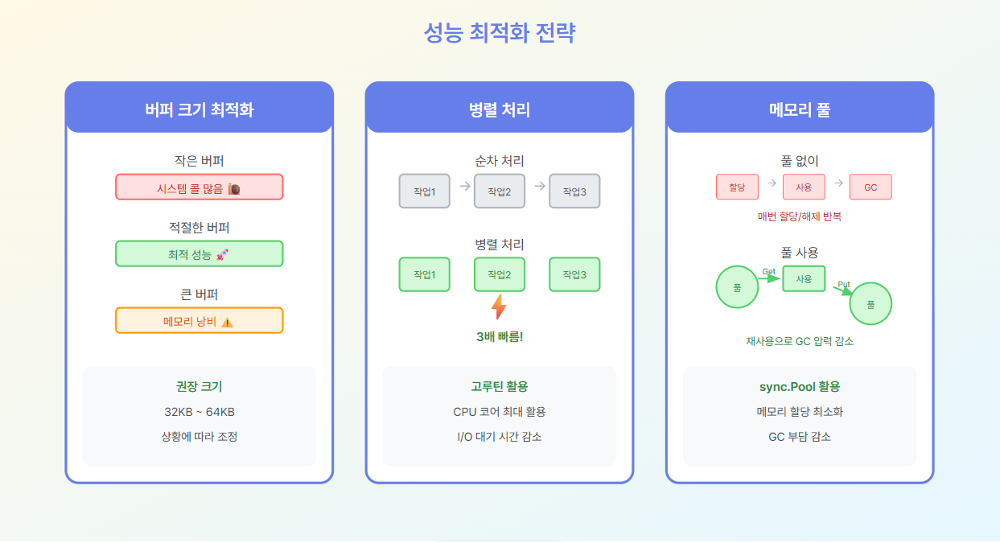

# Step 7: 성능 최적화

## 🎯 학습 목표
- 적절한 버퍼 크기 선택
- 병렬 처리로 속도 향상
- `sync.Pool`로 메모리 최적화
- 벤치마크로 성능 검증

## 📏 버퍼 크기 최적화

### 왜 중요한가?

버퍼 크기는 성능에 **결정적 영향**을 미칩니다!

### 성능 비교표

| 버퍼 크기 | 시스템 콜 횟수 | 처리 시간 | 평가 |
|---------|-------------|---------|------|
| 512B | 20,000회 | 1000ms | 🐌 매우 느림 |
| 1KB | 10,000회 | 500ms | 🐌 느림 |
| 4KB | 2,500회 | 100ms | 👍 괜찮음 |
| 32KB | 312회 | 20ms | 🚀 빠름 |
| 64KB | 156회 | 18ms | 🚀 최적 |
| 128KB | 78회 | 18ms | 👍 괜찮음 |
| 1MB | 10회 | 20ms | ⚠️ 메모리 낭비 |

### 시각화 다이어그램



**참고**: 위 다이어그램은 버퍼 크기 최적화, 병렬 처리, 메모리 풀 등 전체 성능 최적화 전략을 보여줍니다.

### 최적 지점

#### 일반 파일 (HDD/SSD)
**권장: 32KB ~ 64KB**
- 시스템 콜 최소화
- 메모리 낭비 없음
- 캐시 효율 좋음

#### 네트워크
**권장: 4KB ~ 8KB**
- 작은 패킷 단위
- 지연 시간 최소화

#### SSD
**권장: 64KB ~ 128KB**
- 큰 블록 읽기 효율적
- 병렬 처리와 조합

### 버퍼 크기 선택 전략

```
1. 기본값으로 시작 (32KB)
   ↓
2. 벤치마크로 측정
   ↓
3. 시스템 환경 고려
   ↓
4. 최적값 선택
```

## 🔄 병렬 처리로 속도 높이기

### 순차 vs 병렬

#### ❌ 순차 처리
```
파일1 처리 (10초)
  ↓
파일2 처리 (10초)
  ↓
파일3 처리 (10초)
  ↓
파일4 처리 (10초)

총 시간: 40초
```

#### ✅ 병렬 처리
```
파일1 처리 (10초) ──┐
파일2 처리 (10초) ──┼─→ 동시 실행
파일3 처리 (10초) ──┤
파일4 처리 (10초) ──┘

총 시간: 10초 (4배 빠름!)
```

### 워커 풀 패턴

#### 구조
```
작업 큐
  ↓
워커 1 ──┐
워커 2 ──┼─→ 결과 수집
워커 3 ──┤
워커 4 ──┘
```

#### 구성 요소
1. **작업 채널**: 처리할 작업 전달
2. **워커 고루틴**: 작업 수행
3. **결과 채널**: 결과 수집
4. **WaitGroup**: 완료 대기

### 최적 워커 수

| CPU 코어 | 권장 워커 수 | 비고 |
|---------|-----------|------|
| 2코어 | 2~4 | 기본 |
| 4코어 | 4~8 | 일반적 |
| 8코어 | 8~16 | 서버 |
| 16코어+ | 16~32 | 고성능 |

**공식**: `워커 수 = CPU 코어 * 1~2배`

### I/O vs CPU 바운드

#### I/O 바운드 (파일, 네트워크)
- 많은 워커 사용 가능
- 대기 시간 동안 다른 작업

#### CPU 바운드 (압축, 암호화)
- CPU 코어 수만큼 워커
- 더 많으면 오버헤드

## 🎯 sync.Pool - 메모리 최적화

### 문제 상황

#### ❌ 풀 없이
```
요청 1: 버퍼 할당 → 사용 → GC
요청 2: 버퍼 할당 → 사용 → GC
요청 3: 버퍼 할당 → 사용 → GC
...

결과:
- 할당 10,000회
- GC 50회
- CPU 낭비
```

#### ✅ 풀 사용
```
요청 1: 풀에서 가져옴 → 사용 → 풀에 반환
요청 2: 풀에서 가져옴 → 사용 → 풀에 반환
요청 3: 풀에서 가져옴 → 사용 → 풀에 반환
...

결과:
- 할당 100회
- GC 5회
- 효율적!
```

### sync.Pool 사용법

#### 1. 풀 생성
```go
var bufferPool = sync.Pool{
    New: func() interface{} {
        buffer := make([]byte, 64*1024) // 64KB
        return &buffer
    },
}
```

#### 2. 가져오기
```go
bufferPtr := bufferPool.Get().(*[]byte)
buffer := *bufferPtr
```

#### 3. 사용
```go
io.CopyBuffer(dst, src, buffer)
```

#### 4. 반환
```go
defer bufferPool.Put(bufferPtr)
```

### 주의사항

⚠️ **풀에서 가져온 객체의 상태 확인 필요**
- 이전 사용 흔적 남아있을 수 있음
- 필요시 초기화

⚠️ **포인터로 관리**
- 값 복사 방지
- 메모리 효율

⚠️ **GC가 비울 수 있음**
- 메모리 압박 시 풀이 비워질 수 있음
- 그래도 `New` 함수로 재생성

## 📊 성능 측정

### 벤치마크 작성

#### 버퍼 크기 비교
```
다양한 크기 (1KB, 4KB, 32KB, 64KB, 1MB) 테스트
→ 각각 실행 시간 측정
→ 최적값 찾기
```

#### 병렬 처리 비교
```
워커 수 (1, 2, 4, 8, 16) 테스트
→ 처리 속도 측정
→ 최적 워커 수 결정
```

#### 메모리 풀 비교
```
풀 사용 전/후 비교
→ 할당 횟수
→ GC 횟수
→ 메모리 사용량
```

### 측정 도구

```bash
# CPU 프로파일
go test -bench=. -cpuprofile=cpu.prof

# 메모리 프로파일
go test -bench=. -memprofile=mem.prof

# 분석
go tool pprof cpu.prof
```

## 🎓 실습 과제

### 과제 1: 버퍼 크기 벤치마크

**요구사항**:
1. 동일한 파일을 다양한 버퍼 크기로 복사
2. 시간 측정
3. 최적 크기 찾기

**테스트 크기**:
- 1KB, 4KB, 8KB, 16KB, 32KB, 64KB, 128KB, 1MB

### 과제 2: 병렬 파일 압축

**요구사항**:
1. 여러 파일을 동시에 압축
2. 워커 풀 패턴 사용
3. 진행 상황 출력

**구조**:
```
파일 목록 → 작업 채널
            ↓
워커 1, 2, 3, 4 (gzip 압축)
            ↓
결과 채널 → 완료 확인
```

### 과제 3: 메모리 풀 적용

**요구사항**:
1. 파일 복사에 sync.Pool 적용
2. 풀 사용 전/후 비교
3. 메모리 할당 횟수 측정

### 과제 4: 최적화 전/후 비교

**시나리오**:
100개의 10MB 파일을 압축

**측정 항목**:
- 총 처리 시간
- 메모리 사용량
- CPU 사용률

**비교**:
- 순차 처리 vs 병렬 처리
- 풀 없음 vs 풀 사용
- 작은 버퍼 vs 최적 버퍼

## 📈 최적화 전략 다이어그램

### 전체 플로우
```
1. 프로파일링으로 병목 찾기
   ↓
2. 버퍼 크기 최적화
   ↓
3. 병렬 처리 적용
   ↓
4. 메모리 풀 사용
   ↓
5. 벤치마크로 검증
   ↓
6. 반복 (필요시)
```

## 🔑 핵심 요약

### 버퍼 크기
```
작음 (1KB)  → 시스템 콜 많음 → 느림 🐌
최적 (32-64KB) → 균형 잡힘 → 빠름 🚀
큼 (1MB)    → 메모리 낭비 → 그냥 괜찮음 👍
```

### 병렬 처리
```
순차: 작업1 → 작업2 → 작업3 (느림)
병렬: 작업1, 2, 3 동시 실행 (빠름)

워커 수 = CPU 코어 * 1~2배
```

### 메모리 풀
```
풀 없음: 할당/해제 반복 → GC 압력 → 느림
풀 사용: 재사용 → GC 최소화 → 빠름

Get() → 사용 → Put() → 재사용
```

### 최적화 순서
```
1. 측정 (프로파일링)
2. 버퍼 크기
3. 병렬 처리
4. 메모리 풀
5. 검증 (벤치마크)
```

## ➡️ 다음 단계

**Step 8: 에러 처리와 안전성**
- `defer`로 리소스 정리
- `context`로 타임아웃
- 에러 래핑과 추적

